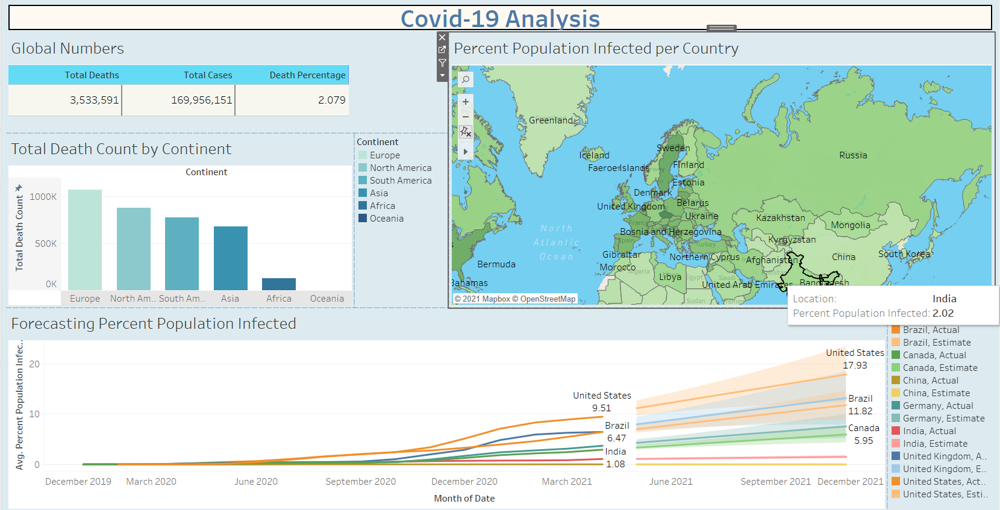

# Covid-19 Analysis

## Project Overview
Created a dashboard using Tableau and SQL that shows the following measures : 
1. Global numbers relating to covid cases and deaths.
2. Total Death Count by continent
3. Percent Population Affected by Country
4. Forecasting Percent Population Affected for the near future.

## Dataset and Data Cleaning
Data for this project was collected from this site : https://ourworldindata.org/covid-deaths.  
The data daily details from 24 February 2020 to 30 May 2021 from all over the world and had almost 50 features to be taken care of. Most of the data cleaning including feature selection was done through MS Excel before passing the data to our SQL Server.  
The data was separeted into two sheets , the first contained the numbers for cases and deaths caused due to covid and the second sheet contained the vaccination data from around the world.

## Data Preparation in SQL Server Management Studio
First we used the data to draw some insightful results about the number of cases and deaths caused during the crucial period of the pandemic.
Some of them were : 
1. Global Numbers -> Total Cases : 169956151 , Total Deaths : 3533591 , Death Percentage : 2.079.  
2. 2% of India's population has been contacted with the virus as of 29th May 2021. 
3. United States of America has had the highest death count between February 2020 and May 2021.
4. As of 29% May , almost 14 % of India's population has been vaccinated with atleast 1st dose.

For creating visualizations in Tableau , we cleaned the data and updated the tables which can be seen in the code. 

## Tableau Dashboard
Four different visualizations were created to put into a single dashboard which can be seen below : 

